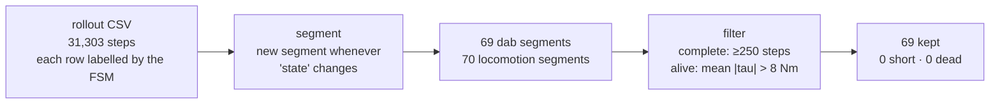

# Dataset composition — how many dabs, and how we know

Reproduce every number with `reports/dataset_stats.py`.

---

## How locomotion and dab are told apart

**They are not inferred from the data — the controller labels every row.**

rl_sar's finite-state machine sets `config_name` whenever it switches policy
(`fsm_robot/fsm_g1.hpp`):

```cpp
rl.config_name = "robomimic/locomotion";   // line 156, on entering locomotion
rl.config_name = "asap_dab";               // line 565, on entering the dab
```

and `RecordRollout()` writes that string into every logged row
(`src/rl_real_g1.cpp:269`):

```cpp
f << t_mono << "," << t_wall << "," << step << "," << this->config_name << ...
```

So the `state` column is ground truth from the controller itself, not a guess made
afterwards from the motion. A row labelled `asap_dab` was produced by the dab policy,
by construction.

---

## Finding individual repetitions



The robot alternates `loco → dab → loco → dab …` because each repetition is triggered
by pressing `1` (locomotion) then `5` (dab); locomotion is the transit into and out of
each dab.

**The two filters, and why they exist**

| filter | rule | catches |
|---|---|---|
| Complete | ≥ 250 steps (a full dab is ~298) | repetitions cut short |
| Alive | mean whole-body \|tau\| > 8 Nm | segments logged *after* a firmware power-cut, where the policy kept running against dead motors |

In earlier sessions the "alive" filter routinely discarded repetitions. **In this
capture it discarded none** — which is itself a result worth stating.

---

## The numbers

### Capture composition

| | rows | share |
|---|---|---|
| Full capture | **31,303** | 100 % |
| `asap_dab` | **20,556** | 65.7 % |
| `robomimic/locomotion` | 10,747 | 34.3 % — excluded from training |

### Repetitions

| | |
|---|---|
| Dab segments found | **69** |
| Dropped — too short | **0** |
| Dropped — dead (post power-cut) | **0** |
| **Kept** | **69** |
| Steps per repetition | 297 – 299 (median **298**, ≈ 6.1 s) |
| Total dab motion | **420 s** |
| Control rate | **48.9 Hz** (measured, not assumed) |

### What gets trained on

```
20,556 rows  −  69 repetitions  =  20,487 transitions
```

A delta-action model learns from **(state, action) → next state** pairs. The last row
of each repetition has no successor *within* that repetition, and it must not be
paired with the first row of the next one — that would teach the model a
discontinuity that never physically occurred. So exactly one pair is lost per
trajectory.

**Final: 69 trajectories · 20,487 transitions · one dab each.**

---

## Is that enough?

For a single skill, a typical delta-action dataset is 20–50 repetitions
(~6k–15k transitions). At 69 repetitions and 20,487 transitions this is comfortably
sufficient **in quantity**.

The real limitation is **coverage, not count**: all 69 are the same motion performed
from broadly the same place in the capture volume. A model fitted here will be
accurate on that trajectory and unproven away from it. The next session should add
variety rather than volume — different positions and headings, a few repetitions at
reduced action scale, and small perturbations so the model sees off-nominal states.
