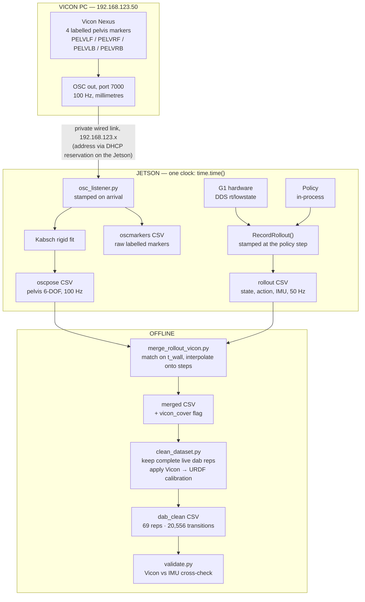

# G1 + Vicon capture pipeline (current — 2026-07-31)

Supersedes the earlier version of this diagram, which was wrong in three ways:
it showed the link as `169.254.x` (that addressing caused the DDS locator fault and
was removed), it included a marker-repair step (abandoned — it made the pose worse),
and it stopped at the merged CSV (the cleaning/calibration stage was missing).

## Current pipeline

## What changed from the previous diagram

| | was | now |
|---|---|---|
| Link addressing | `169.254.x` link-local | **`192.168.123.x`** — Vicon PC gets `.50` by DHCP reservation |
| Marker repair step | `repair_markers.py` in the chain | **removed** — abandoned |
| Final output | merged CSV | **`dab_clean` CSV** after calibration + rep extraction |

**Why the addressing changed.** The `169.254.100.1` address lived on the same
interface as the robot's `192.168.123.164`, so the Jetson advertised *two* DDS
locators. The robot intermittently sent `rt/lowstate` to the unreachable one, which
looked like random comms loss and forced repeated power cycles. The interface now
carries a single address and the Vicon PC sits on the robot's own subnet.

**Why the repair step went away.** It relabelled frames whose marker geometry didn't
match a rigid reference. On a near-symmetric cluster a 180°-rotated labelling fits
just as well, so it "fixed" frames into the flipped labelling and made the pose worse
(39 → 134 orientation jumps). Redefining the Nexus subject removed the problem at
source instead: 655 flips → 0.

## Sync, in one line

Both streams are timestamped by the **same machine**, so there is only one clock —
alignment is timestamp matching, not offset estimation. Verified: cross-correlating
Vicon-derived and IMU angular velocity peaks at **0 ms lag**.
