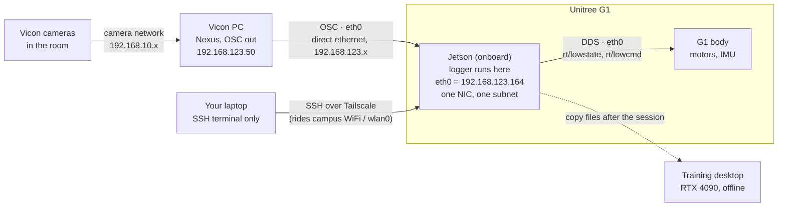

# Physical / network topology — corrected

Fixes to the previous version of this diagram:

1. **`eth1` does not exist.** The Jetson has exactly one physical ethernet port,
   `eth0`. Verified: `ip -br link` shows only `eth0`, `wlan0`, `tailscale0`
   (plus virtual `docker0` / `l4tbr0` / `rndis0` / `usb0` / `dummy0`).
   Both the OSC mocap stream **and** the robot DDS traffic arrive on **`eth0`**.
2. **No network switch.** The Vicon PC connects by a direct ethernet cable to a
   G1 jack. The laptop reaches the Jetson over campus WiFi via Tailscale.
3. **The Jetson is onboard the G1**, not a separate machine beside it.

## Diagram

## Why "one NIC, one subnet" is on the diagram

That is the design decision that made the robot stable, so it is worth showing.

Earlier, `eth0` carried a **second** address (`169.254.100.1`) so it could reach the
Vicon PC on a link-local subnet. The Jetson then advertised **two DDS locators**, and
the robot intermittently sent `rt/lowstate` to the unreachable one — which looked
like random comms loss and forced repeated power cycles.

The fix was to bring the Vicon PC onto the robot's own subnet (a DHCP reservation on
the Jetson hands it `192.168.123.50`), so `eth0` needs only one address. OSC and DDS
now share that single interface with no ambiguity.

## The Jetson's three network paths

Only `eth0` carries data. The other two are for human access.

| interface | address | carries |
|---|---|---|
| `eth0` | `192.168.123.164` | robot DDS **and** the Vicon OSC stream |
| `wlan0` | `10.84.208.172` | campus WiFi — underlies Tailscale |
| `tailscale0` | `100.109.251.70` | SSH from the laptop |

## Operational note

Without a switch, the laptop depends on campus WiFi plus Tailscale to reach the
Jetson. That path has been unreliable in the past. It does not affect the capture —
the Vicon link is wired and the Jetson logs locally regardless of whether the laptop
is connected — but if WiFi drops mid-session the console is lost. The fallback is to
plug the laptop into a spare G1 jack, or to reintroduce a switch.
